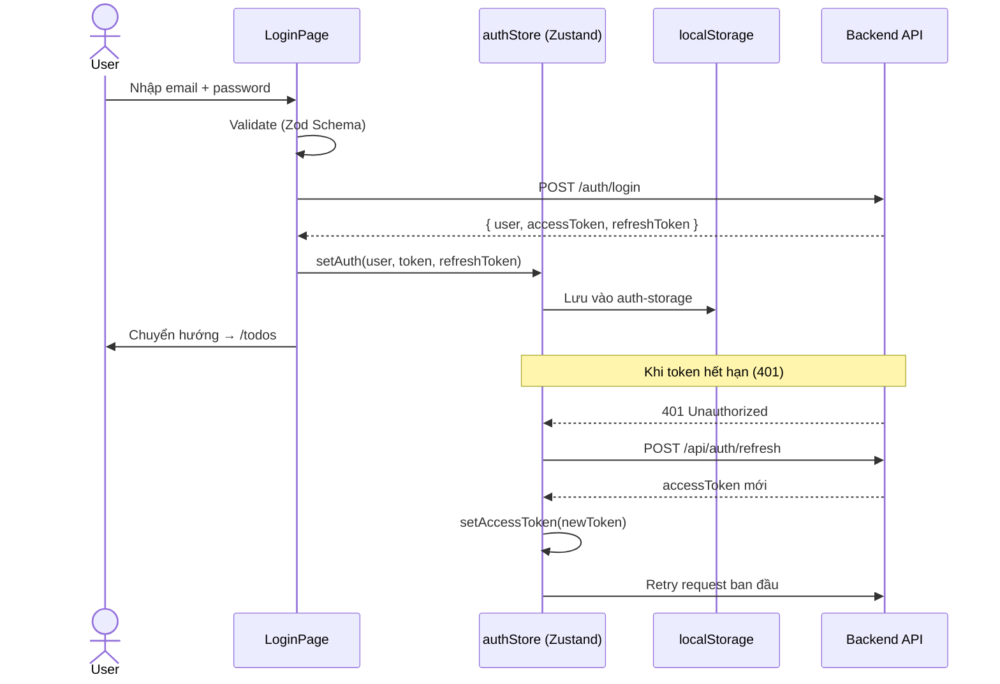
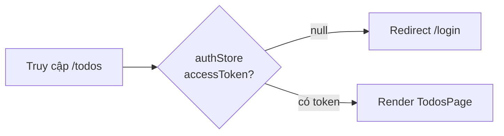
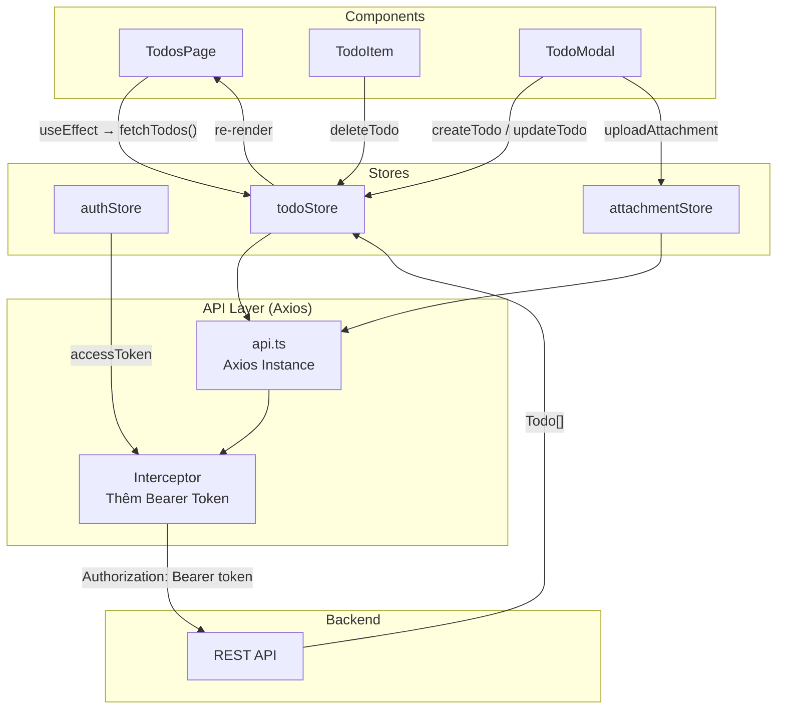
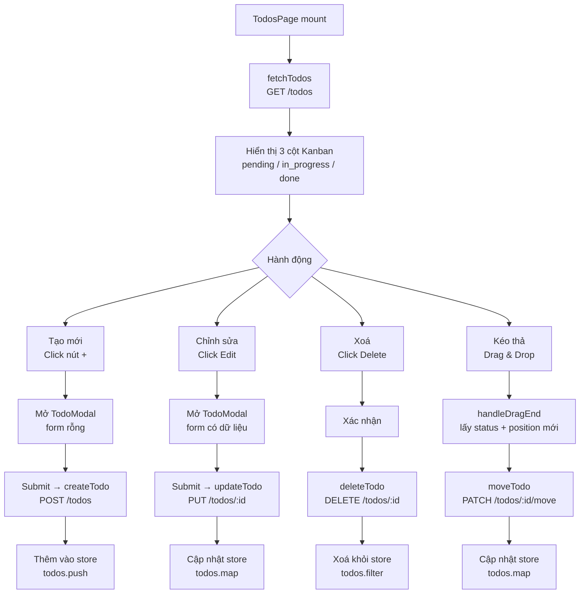
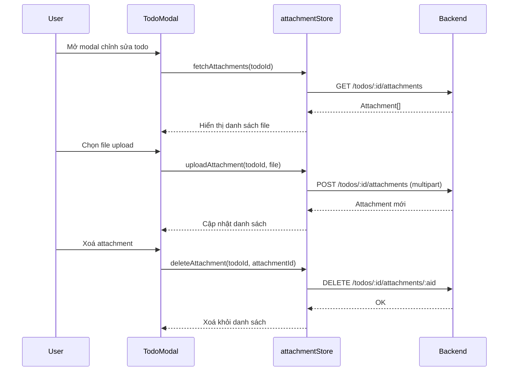
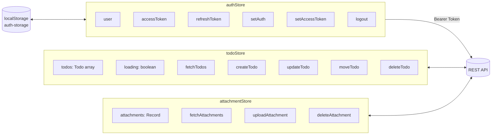

# Quy trình tổng thể - TodoList Frontend

## 1. Kiến trúc tổng quan

```mermaid
graph TD
    A[Browser] --> B[main.tsx\nReactDOM.createRoot]
    B --> C[App.tsx\nReact Router v6]
    C --> D{Route}
    D --> E[/login → LoginPage]
    D --> F[/register → RegisterPage]
    D --> G[/todos → ProtectedRoute]
    G --> H{Có accessToken?}
    H -- Không --> E
    H -- Có --> I[TodosPage\nKanban Board]
```

---

## 2. Luồng xác thực (Authentication)



---

## 3. Luồng bảo vệ route (ProtectedRoute)



---

## 4. Luồng dữ liệu chính (Data Flow)



---

## 5. Luồng CRUD Todo



---

## 6. Luồng Attachment (Đính kèm file)



---

## 7. Cấu trúc Component

```mermaid
graph TD
    App --> Router[BrowserRouter]
    Router --> Routes
    Routes --> Login[LoginPage]
    Routes --> Register[RegisterPage]
    Routes --> PR[ProtectedRoute]
    PR --> TodosPage

    TodosPage --> Header
    Header --> UserMenu[User Info + Logout]

    TodosPage --> DndContext[DndContext\n@dnd-kit/core]
    DndContext --> Col1[Cột: Pending]
    DndContext --> Col2[Cột: In Progress]
    DndContext --> Col3[Cột: Done]

    Col1 --> TI1[TodoItem x N]
    Col2 --> TI2[TodoItem x N]
    Col3 --> TI3[TodoItem x N]

    TI1 --> Actions1[Edit / Delete buttons]
    DndContext --> Overlay[DragOverlay\nghost card]

    TodosPage --> TM[TodoModal\nCreate / Edit]
    TM --> Form[React Hook Form + Zod]
    TM --> AttachList[Attachment List]
```

---

## 8. State Management (Zustand Stores)



---

## 9. Tóm tắt quy trình end-to-end

```
[User mở app]
      │
      ▼
[main.tsx] → [App.tsx] → [Router kiểm tra route]
      │
      ▼
[ProtectedRoute kiểm tra localStorage]
      │
      ├── Chưa đăng nhập ──→ [LoginPage] ──→ POST /auth/login ──→ Lưu token vào store
      │
      └── Đã đăng nhập ──→ [TodosPage]
                                │
                                ▼
                          [fetchTodos] → GET /todos → Hiển thị Kanban
                                │
                          ┌─────┴──────┐──────────────┐
                          ▼            ▼               ▼
                      [Tạo todo]  [Kéo thả]       [Xoá todo]
                      POST /todos  PATCH /move     DELETE /todos/:id
                          │            │               │
                          └─────┬──────┘───────────────┘
                                ▼
                          [Store cập nhật] → [UI re-render]
```
